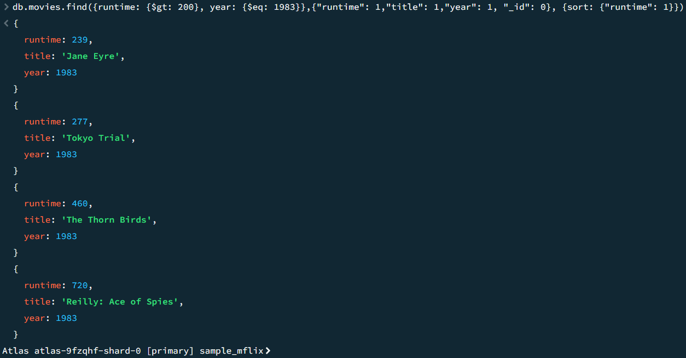
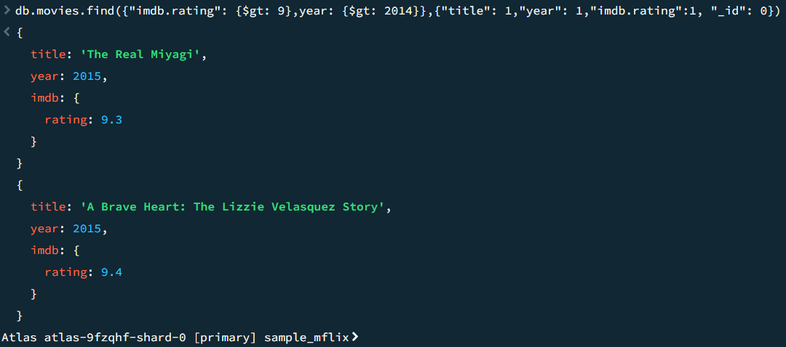

# cs-3980-hw3
## Query 1
```
db.movies.find({runtime: {$gt: 200}, year: {$eq: 1983}},{"runtime": 1,"title": 1,"year": 1, "_id": 0}, {sort: {"runtime": 1}})
```
Results:

## Query 2
```
db.movies.find({"imdb.rating": {$gt: 9},year: {$gt: 2014}},{"title": 1,"year": 1,"imdb.rating":1, "_id": 0})
```
Results:

## Resources Used
[db.collection.find documentation](https://www.mongodb.com/docs/manual/reference/method/db.collection.find/#mongodb-method-db.collection.find)

[query predicate options](https://www.mongodb.com/docs/manual/reference/mql/query-predicates/#std-label-query-projection-operators-top)
